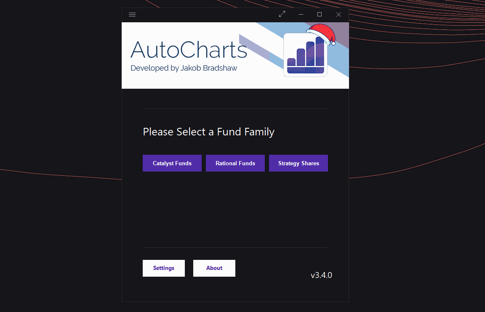

# AutoCharts

AutoCharts is a program that automatically updates the Catalyst/Rational/Strategy Shares fund fact sheets and other marketing material every quarter when new financial data is available. This is a program designed with various technologies like AutoIt, Node.JS, and amCharts.

## Prerequisites

Please make sure you have the following installed on your system:
* Node.JS
* Dropbox
* Microsoft Excel
* Adobe InDesign
* Datalinker Plugin for Adobe InDesign
* Firefox

Please note that Node.js is included in the installer file for AutoCharts2.0. So it should install for you if you have not installed seperately.

The Smart Sync "AutoCharts&Tables" folder in the shared Dropbox folder must be set to Local. For more information on Dropbox's Smart Sync, go here:  
https://help.dropbox.com/installs-integrations/sync-uploads/smart-sync

## Installation

Use the installer file here:   
[https://www.dropbox.com/sh/4ccj4zkz9q5ychg/AACQbPWlp15-9ePd69bPTZ0ba?dl=0](https://www.dropbox.com/sh/4ccj4zkz9q5ychg/AACQbPWlp15-9ePd69bPTZ0ba?dl=0)

## Usage

* Double check the prerequisites above!

* Before you run through an update, you need to update the settings by going to Settings > Edit  
  

* Once you have updated the backup file located in Dropbox (Marketing Team Files\Marketing Materials\AutoCharts&Tables\Backup Files) you must **SYNC** it with AutoCharts. To do this, simply select "Sync Files" in the Files menu.  
  

* Lastly, to update a fund, just select it and click "Process Updates"  
  

## Requests and Future Development
AutoCharts2 is still in active development and more features will be coming soon. Please feel free to request new features with me at jakob.bradshaw@catalystmf.com

This program was built and designed for the internal use of the marketing department of Catalyst Funds. 

## License
[MIT](https://choosealicense.com/licenses/mit/)